# Models & Utilities

## Task

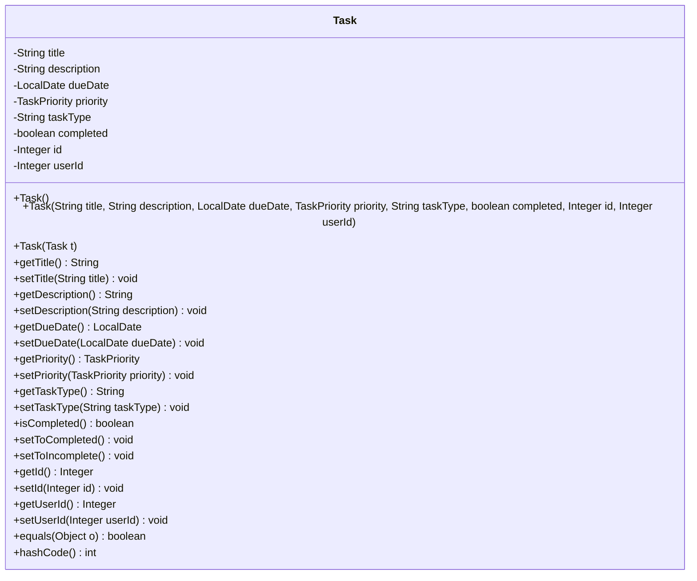
```mermaid
classDiagram
    class Task {
        -String title
        -String description
        -LocalDate dueDate
        -TaskPriority priority
        -String taskType
        -boolean completed
        -Integer id
        -Integer userId
        +Task()
        +Task(String title, String description, LocalDate dueDate, TaskPriority priority, String taskType, boolean completed, Integer id, Integer userId)
        +Task(Task t)
        +getTitle() String
        +setTitle(String title) void
        +getDescription() String
        +setDescription(String description) void
        +getDueDate() LocalDate
        +setDueDate(LocalDate dueDate) void
        +getPriority() TaskPriority
        +setPriority(TaskPriority priority) void
        +getTaskType() String
        +setTaskType(String taskType) void
        +isCompleted() boolean
        +setToCompleted() void
        +setToIncomplete() void
        +getId() Integer
        +setId(Integer id) void
        +getUserId() Integer
        +setUserId(Integer userId) void
        +equals(Object o) boolean
        +hashCode() int
    }
```

## TaskPriority

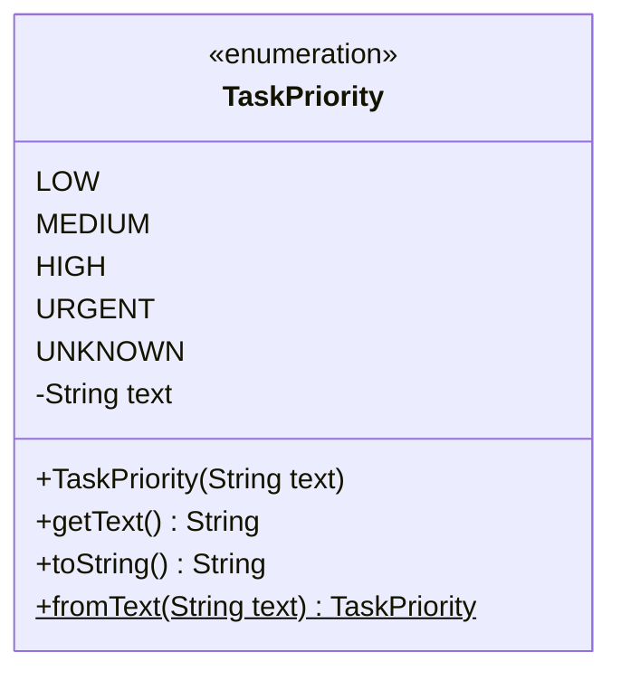
```mermaid
classDiagram
    class TaskPriority {
        <<enumeration>>
        LOW
        MEDIUM
        HIGH
        URGENT
        UNKNOWN
        -String text
        +TaskPriority(String text)
        +getText() String
        +toString() String
        +fromText(String text)$ TaskPriority
    }
```

## TaskType

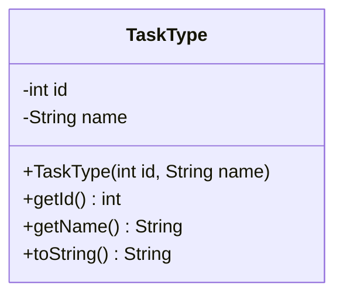
```mermaid
classDiagram
    class TaskType {
        -int id
        -String name
        +TaskType(int id, String name)
        +getId() int
        +getName() String
        +toString() String
    }
```

## User

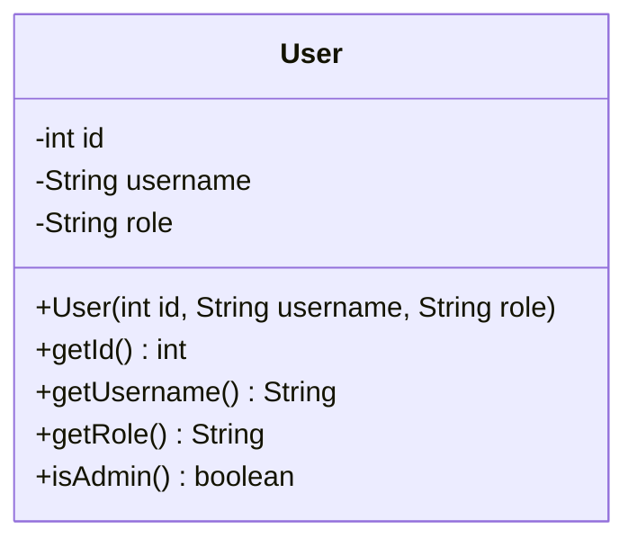
```mermaid
classDiagram
    class User {
        -int id
        -String username
        -String role
        +User(int id, String username, String role)
        +getId() int
        +getUsername() String
        +getRole() String
        +isAdmin() boolean
    }
```

## DashboardStats

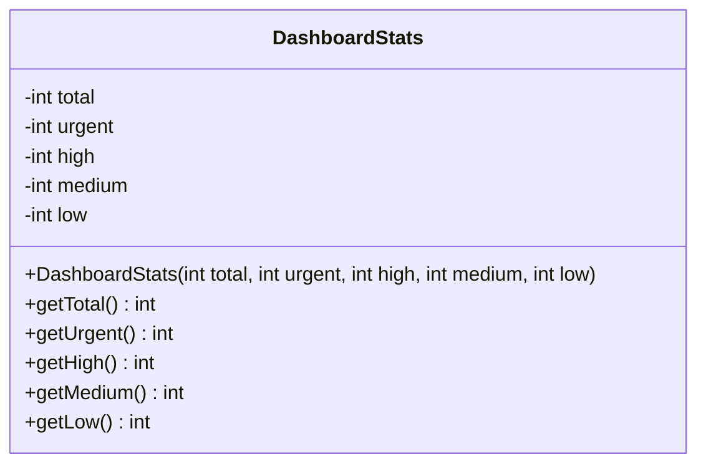
```mermaid
classDiagram
    class DashboardStats {
        -int total
        -int urgent
        -int high
        -int medium
        -int low
        +DashboardStats(int total, int urgent, int high, int medium, int low)
        +getTotal() int
        +getUrgent() int
        +getHigh() int
        +getMedium() int
        +getLow() int
    }
```

## DashboardStatsUtil

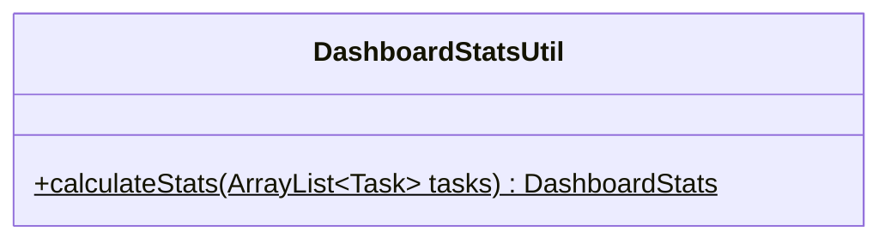
```mermaid
classDiagram
    class DashboardStatsUtil {
        +calculateStats(ArrayList~Task~ tasks)$ DashboardStats
    }
```

---

# Application & Infrastructure

## SceneManager

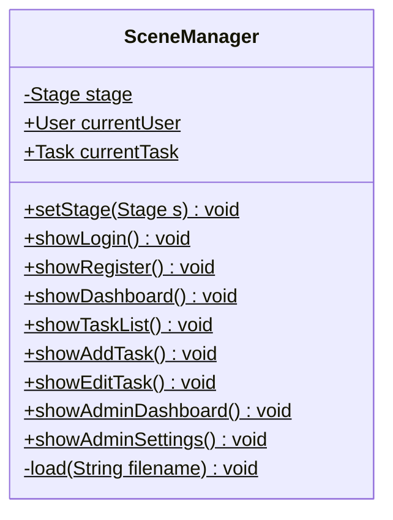
```mermaid
classDiagram
    class SceneManager {
        -Stage stage$
        +User currentUser$
        +Task currentTask$
        +setStage(Stage s)$ void
        +showLogin()$ void
        +showRegister()$ void
        +showDashboard()$ void
        +showTaskList()$ void
        +showAddTask()$ void
        +showEditTask()$ void
        +showAdminDashboard()$ void
        +showAdminSettings()$ void
        -load(String filename)$ void
    }
```

## Database

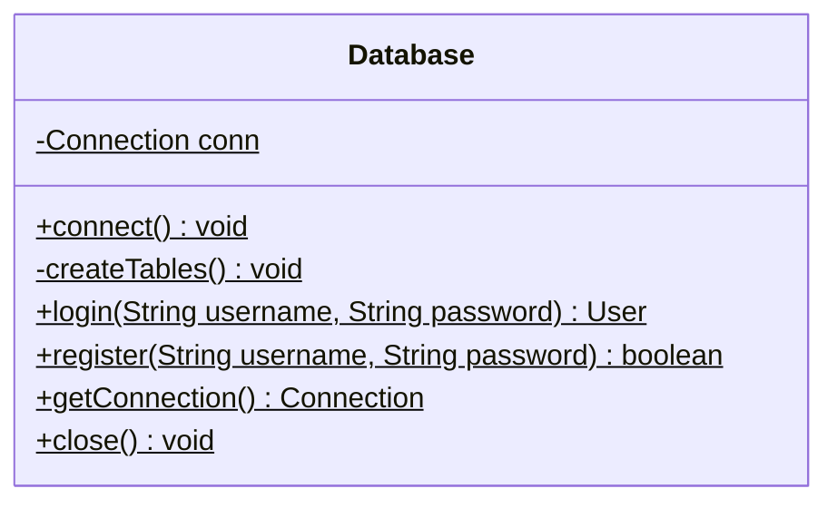
```mermaid
classDiagram
    class Database {
        -Connection conn$
        +connect()$ void
        -createTables()$ void
        +login(String username, String password)$ User
        +register(String username, String password)$ boolean
        +getConnection()$ Connection
        +close()$ void
    }
```

---

# Controllers

## LoginController

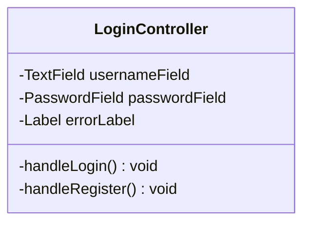
```mermaid
classDiagram
    class LoginController {
        -TextField usernameField
        -PasswordField passwordField
        -Label errorLabel
        -handleLogin() void
        -handleRegister() void
    }
```

## RegisterController

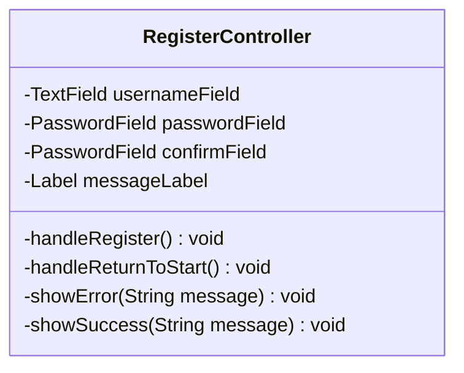
```mermaid
classDiagram
    class RegisterController {
        -TextField usernameField
        -PasswordField passwordField
        -PasswordField confirmField
        -Label messageLabel
        -handleRegister() void
        -handleReturnToStart() void
        -showError(String message) void
        -showSuccess(String message) void
    }
```

## UserDashboardController

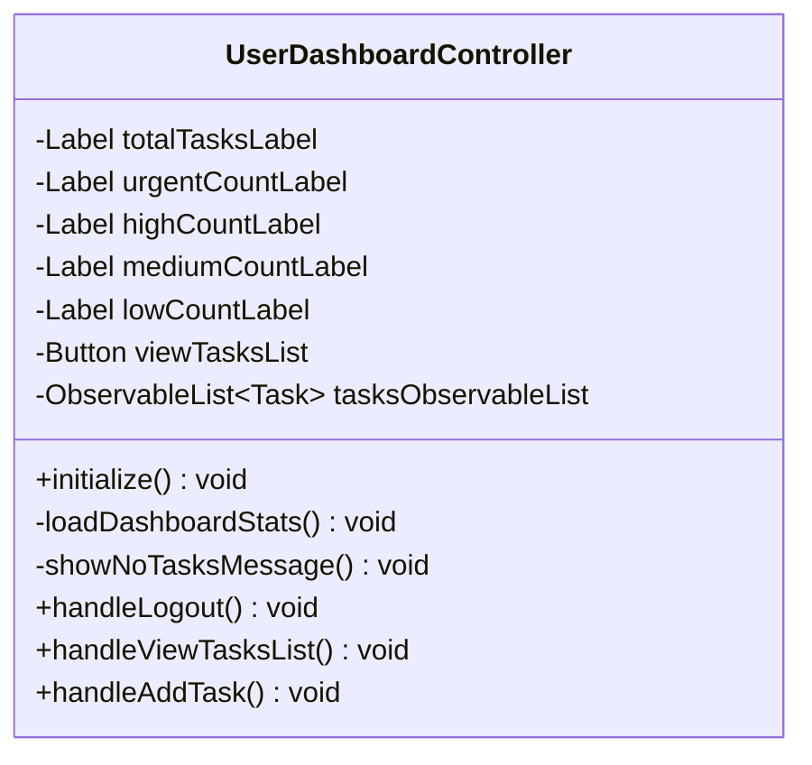
```mermaid
classDiagram
    class UserDashboardController {
        -Label totalTasksLabel
        -Label urgentCountLabel
        -Label highCountLabel
        -Label mediumCountLabel
        -Label lowCountLabel
        -Button viewTasksList
        -ObservableList~Task~ tasksObservableList
        +initialize() void
        -loadDashboardStats() void
        -showNoTasksMessage() void
        +handleLogout() void
        +handleViewTasksList() void
        +handleAddTask() void
    }
```

## AdminDashboardController

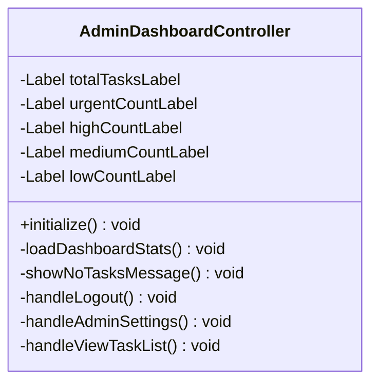
```mermaid
classDiagram
    class AdminDashboardController {
        -Label totalTasksLabel
        -Label urgentCountLabel
        -Label highCountLabel
        -Label mediumCountLabel
        -Label lowCountLabel
        +initialize() void
        -loadDashboardStats() void
        -showNoTasksMessage() void
        -handleLogout() void
        -handleAdminSettings() void
        -handleViewTaskList() void
    }
```

## AdminSettingsController

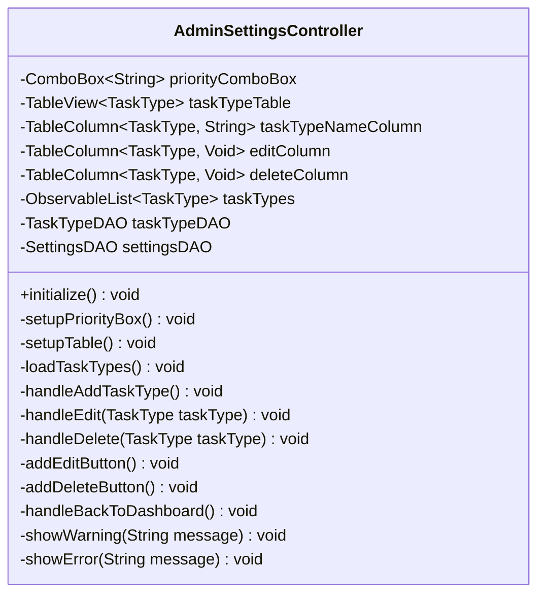
```mermaid
classDiagram
    class AdminSettingsController {
        -ComboBox~String~ priorityComboBox
        -TableView~TaskType~ taskTypeTable
        -TableColumn~TaskType, String~ taskTypeNameColumn
        -TableColumn~TaskType, Void~ editColumn
        -TableColumn~TaskType, Void~ deleteColumn
        -ObservableList~TaskType~ taskTypes
        -TaskTypeDAO taskTypeDAO
        -SettingsDAO settingsDAO
        +initialize() void
        -setupPriorityBox() void
        -setupTable() void
        -loadTaskTypes() void
        -handleAddTaskType() void
        -handleEdit(TaskType taskType) void
        -handleDelete(TaskType taskType) void
        -addEditButton() void
        -addDeleteButton() void
        -handleBackToDashboard() void
        -showWarning(String message) void
        -showError(String message) void
    }
```

## TaskListController

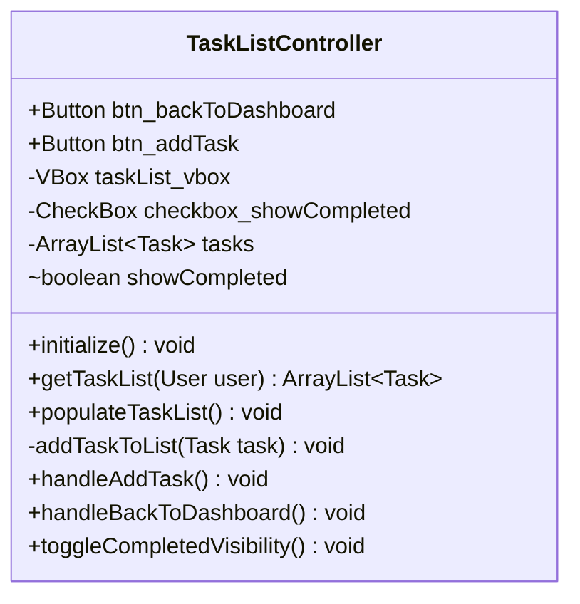
```mermaid
classDiagram
    class TaskListController {
        +Button btn_backToDashboard
        +Button btn_addTask
        -VBox taskList_vbox
        -CheckBox checkbox_showCompleted
        -ArrayList~Task~ tasks
        ~boolean showCompleted
        +initialize() void
        +getTaskList(User user) ArrayList~Task~
        +populateTaskList() void
        -addTaskToList(Task task) void
        +handleAddTask() void
        +handleBackToDashboard() void
        +toggleCompletedVisibility() void
    }
```

## TaskListItemController

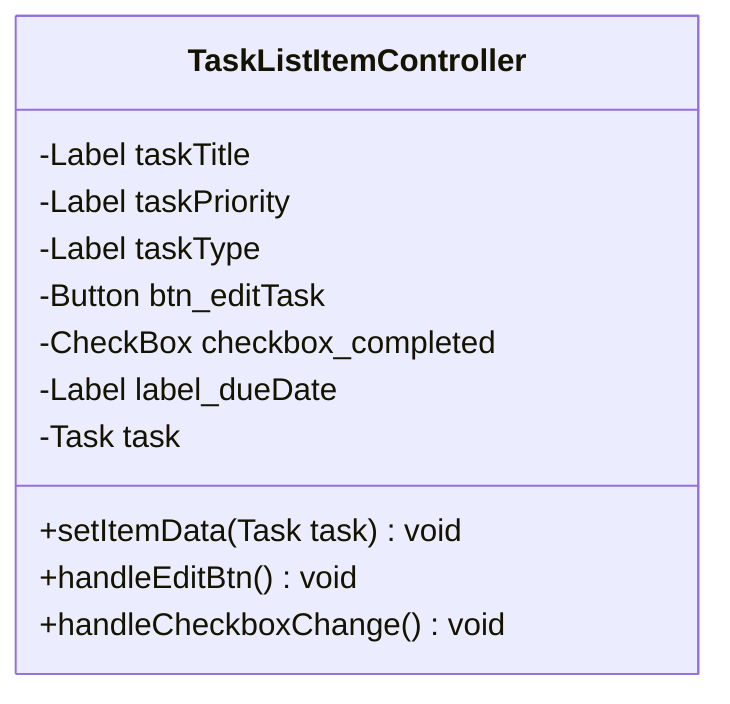
```mermaid
classDiagram
    class TaskListItemController {
        -Label taskTitle
        -Label taskPriority
        -Label taskType
        -Button btn_editTask
        -CheckBox checkbox_completed
        -Label label_dueDate
        -Task task
        +setItemData(Task task) void
        +handleEditBtn() void
        +handleCheckboxChange() void
    }
```

## TaskAddController

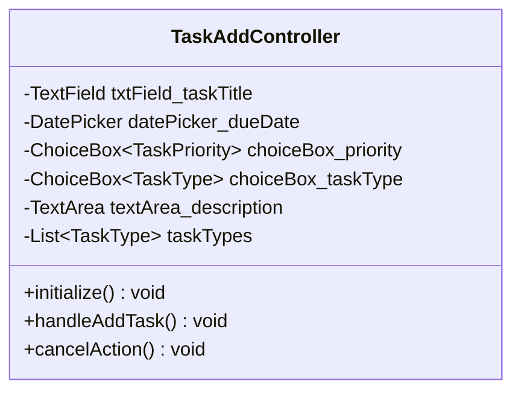
```mermaid
classDiagram
    class TaskAddController {
        -TextField txtField_taskTitle
        -DatePicker datePicker_dueDate
        -ChoiceBox~TaskPriority~ choiceBox_priority
        -ChoiceBox~TaskType~ choiceBox_taskType
        -TextArea textArea_description
        -List~TaskType~ taskTypes
        +initialize() void
        +handleAddTask() void
        +cancelAction() void
    }
```

## EditTaskController

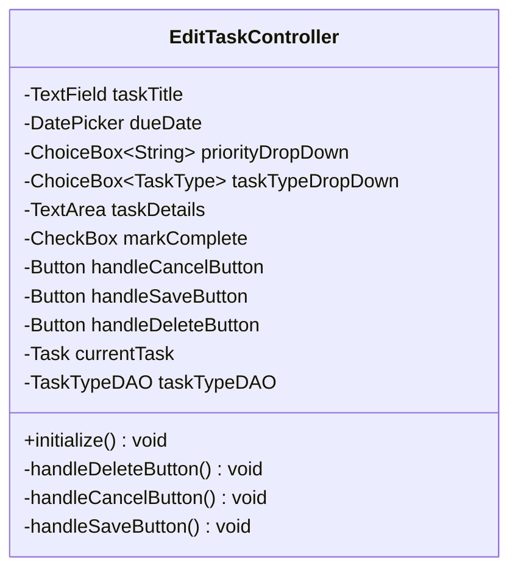
```mermaid
classDiagram
    class EditTaskController {
        -TextField taskTitle
        -DatePicker dueDate
        -ChoiceBox~String~ priorityDropDown
        -ChoiceBox~TaskType~ taskTypeDropDown
        -TextArea taskDetails
        -CheckBox markComplete
        -Button handleCancelButton
        -Button handleSaveButton
        -Button handleDeleteButton
        -Task currentTask
        -TaskTypeDAO taskTypeDAO
        +initialize() void
        -handleDeleteButton() void
        -handleCancelButton() void
        -handleSaveButton() void
    }
```

---

# DAO Layer

## TasksDAO

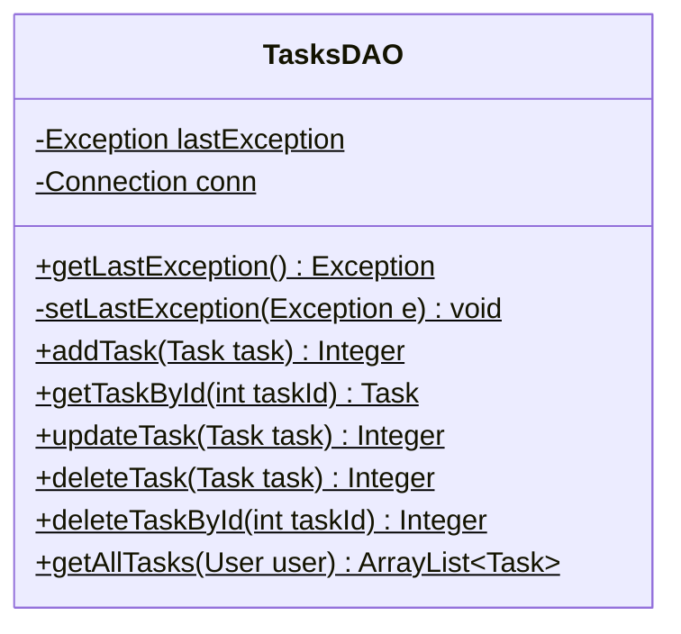
```mermaid
classDiagram
    class TasksDAO {
        -Exception lastException$
        -Connection conn$
        +getLastException()$ Exception
        -setLastException(Exception e)$ void
        +addTask(Task task)$ Integer
        +getTaskById(int taskId)$ Task
        +updateTask(Task task)$ Integer
        +deleteTask(Task task)$ Integer
        +deleteTaskById(int taskId)$ Integer
        +getAllTasks(User user)$ ArrayList~Task~
    }
```

## SettingsDAO

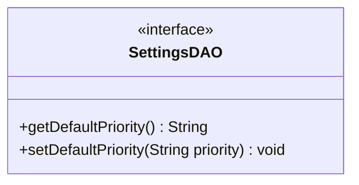
```mermaid
classDiagram
    class SettingsDAO {
        <<interface>>
        +getDefaultPriority() String
        +setDefaultPriority(String priority) void
    }
```

## SQLiteSettingsDAO

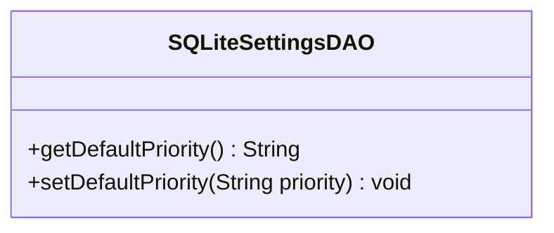
```mermaid
classDiagram
    class SQLiteSettingsDAO {
        +getDefaultPriority() String
        +setDefaultPriority(String priority) void
    }
```

## TaskTypeDAO

```mermaid
classDiagram
    class TaskTypeDAO {
        <<interface>>
        +getAllTaskTypes() List~TaskType~
        +addTaskType(String name) void
        +updateTaskType(int id, String name) void
        +deleteTaskType(int id) void
        +existsByName(String name) boolean
    }
```

## SQLiteTaskTypeDAO

```mermaid
classDiagram
    class SQLiteTaskTypeDAO {
        +getAllTaskTypes() List~TaskType~
        +addTaskType(String name) void
        +updateTaskType(int id, String name) void
        +deleteTaskType(int id) void
        +existsByName(String name) boolean
    }
```

---
